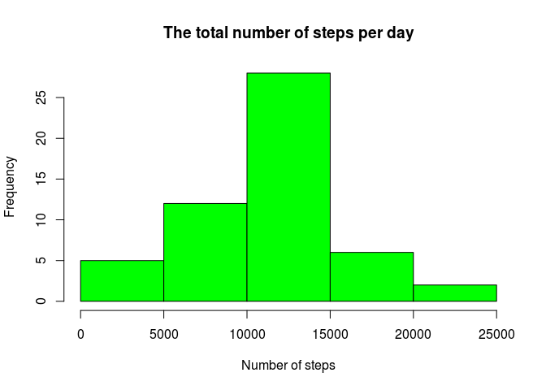

# Reproducible Research: Peer Assessment 1


## 1. Loading and preprocessing the data 
### Pre-requisite
Data file *activity.csv* (uncompressed version of the *[activity.zip](https://d396qusza40orc.cloudfront.net/repdata%2Fdata%2Factivity.zip)*) has to be preset in the working folder. 

### Loading 
Data is loaded into *activity_data_raw* data frame.

```r
activity_data_raw <- read.csv('activity.csv')
head(activity_data_raw)
```

```
##   steps       date interval
## 1    NA 2012-10-01        0
## 2    NA 2012-10-01        5
## 3    NA 2012-10-01       10
## 4    NA 2012-10-01       15
## 5    NA 2012-10-01       20
## 6    NA 2012-10-01       25
```

```r
nrow(activity_data_raw)
```

```
## [1] 17568
```
### Preprocessing 
For later use *activity_data_without_na* data frame is created by removing rows with NA values (can be verfied by comparing the output of *nrow* function)

```r
activity_data_without_na <- na.omit(activity_data_raw)
head(activity_data_without_na)
```

```
##     steps       date interval
## 289     0 2012-10-02        0
## 290     0 2012-10-02        5
## 291     0 2012-10-02       10
## 292     0 2012-10-02       15
## 293     0 2012-10-02       20
## 294     0 2012-10-02       25
```

```r
nrow(activity_data_without_na)
```

```
## [1] 15264
```

## 2. What is mean total number of steps taken per day?
The total number of steps for each day is calculated by creating data frame *activity_per_day* ,by using *aggregate* function to sum up total steps taken each day 

```r
activity_per_day <- aggregate(steps ~ date, data = activity_data_raw, FUN = sum)
head(activity_per_day)
```

```
##         date steps
## 1 2012-10-02   126
## 2 2012-10-03 11352
## 3 2012-10-04 12116
## 4 2012-10-05 13294
## 5 2012-10-06 15420
## 6 2012-10-07 11015
```
The histogram showing total number of steps each day has been created using *hist* plotting function

```r
hist(activity_per_day$steps, xlab = "The total num. of steps per day", main = NULL, col = "green")
```

 

The mean is calculated using R's *mean* function

```r
mean(activity_per_day$steps)
```

```
## [1] 10766.19
```
The median is calculated using R's *median* function

```r
median(activity_per_day$steps)
```

```
## [1] 10765
```

## 3. What is the average daily activity pattern?


## 4. Imputing missing values


## 5. Are there differences in activity patterns between weekdays and weekends?
